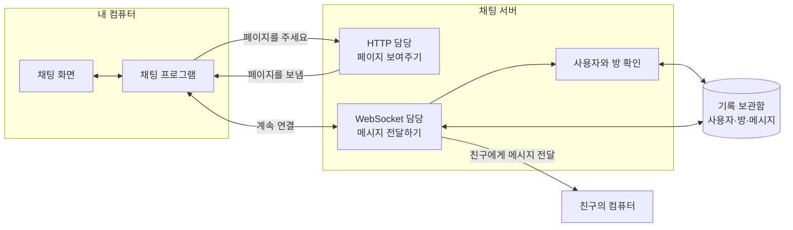
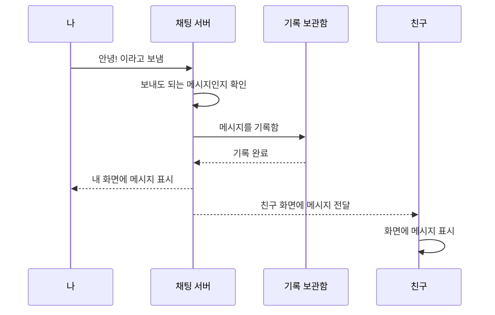

# WebSocket

## 1. WebSocket이란?

WebSocket은 컴퓨터와 서버가 계속 연결되어 서로 이야기를 주고받게 해주는 방법입니다.

쉽게 말하면 다음과 같습니다.

- HTTP: 편지를 보내고 답장을 기다리는 방법
- WebSocket: 전화 통화를 하듯 연결해 두고 바로바로 이야기하는 방법

채팅에서는 친구가 메시지를 보내자마자 내 화면에 보여야 합니다. WebSocket을 사용하면 서버가 새 메시지를 받는 즉시 내 컴퓨터로 보내줄 수 있습니다.

```js
const socket = new WebSocket("ws://localhost:3000");

socket.addEventListener("open", () => {
  socket.send("안녕하세요!");
});

socket.addEventListener("message", (event) => {
  console.log("받은 메시지:", event.data);
});
```

`ws://`는 WebSocket 연결을 뜻합니다. 웹사이트가 안전한 `https://`를 사용한다면 `wss://`를 사용합니다.

## 2. HTTP와 WebSocket의 차이

| 구분 | HTTP | WebSocket |
| --- | --- | --- |
| 비유 | 편지를 보내고 답장을 기다리기 | 전화 통화를 계속하기 |
| 대화 방법 | 보통 내가 물어봐야 서버가 대답함 | 나와 서버가 언제든 말할 수 있음 |
| 연결 | 요청할 때 연결하고 일이 끝나면 끝남 | 연결한 뒤 계속 유지함 |
| 새 메시지 알림 | 내가 계속 물어봐야 알 수 있음 | 서버가 바로 알려줄 수 있음 |
| 잘 어울리는 일 | 웹 페이지 보기, 로그인, 사진 받기 | 채팅, 실시간 알림, 온라인 게임 |

WebSocket이 HTTP보다 항상 좋은 것은 아닙니다. 웹 페이지를 보여주거나 로그인하는 일은 HTTP가 잘 맞습니다. 친구가 보낸 채팅 메시지를 바로 보여주는 일은 WebSocket이 잘 맞습니다. 그래서 채팅 서비스는 보통 HTTP와 WebSocket을 함께 사용합니다.

## 3. 실시간 채팅 서비스의 모습

### 전체 그림



### 메시지가 전달되는 순서



## 4. 각 부분이 하는 일

- 채팅 화면: 메시지를 입력하고 보여줍니다.
- HTTP 서버: 채팅 화면에 필요한 HTML, CSS, JavaScript를 보내줍니다.
- WebSocket 서버: 사람들의 연결을 기억하고 메시지를 전달합니다.
- 데이터베이스: 사용자, 채팅방, 메시지를 오래 보관합니다.
- 클라이언트 프로그램: 서버에 메시지를 보내고 받은 메시지를 화면에 보여줍니다.

현재 프로젝트의 `server.js`는 채팅 화면 파일을 보내주는 HTTP 서버입니다. 진짜 여러 사람이 함께 채팅하려면 WebSocket 서버를 추가해야 합니다.

## 5. 메시지는 어떤 모양으로 보낼까?

메시지를 그냥 글자만 보내는 것보다, 이름표가 붙은 상자처럼 보내면 편리합니다.

```json
{
  "type": "chat",
  "roomId": "room-1",
  "message": "안녕하세요!",
  "sentAt": "2026-09-15T12:00:00.000Z"
}
```

- `type`: 어떤 종류의 메시지인지 표시합니다.
- `roomId`: 어느 채팅방의 메시지인지 표시합니다.
- `message`: 실제로 보낼 글입니다.
- `sentAt`: 메시지를 보낸 시간입니다.

`type`을 사용하면 채팅 메시지뿐 아니라 “누군가 들어왔어요”, “누군가 나갔어요”, “친구가 글을 쓰고 있어요” 같은 것도 구분할 수 있습니다.

## 6. 꼭 기억할 점

- HTTP는 편지를 주고받는 것처럼 요청하고 답을 받는 방법입니다.
- WebSocket은 전화처럼 연결을 계속 유지하는 방법입니다.
- 채팅 서비스는 화면을 가져올 때 HTTP를 사용합니다.
- 채팅 메시지를 바로 전달할 때 WebSocket을 사용합니다.
- 서버는 아무나 채팅방에 들어오지 못하도록 확인해야 합니다.
- 인터넷에 서비스를 공개할 때는 안전한 `wss://`를 사용해야 합니다.
